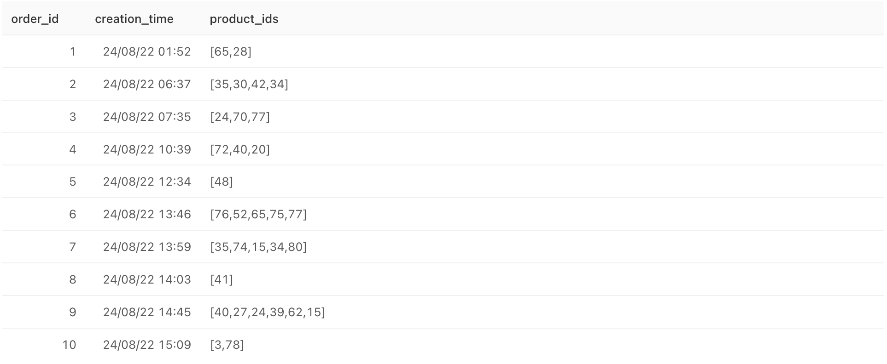
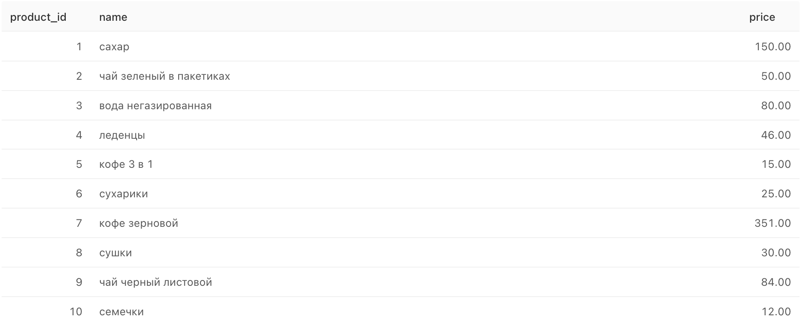
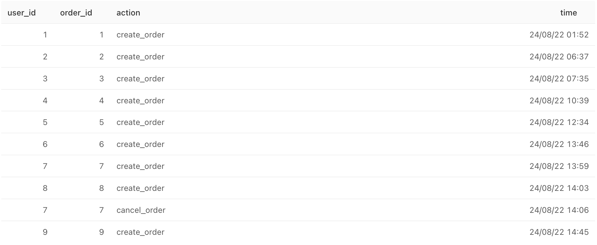

# Unique Product Pairs Frequency in Orders

## Description

Find out which pairs of products are bought together most often.

Form pairs of goods based on the table with orders. Canceled orders are ignored. As a result, display two columns - a column with pairs of product names and a column with values showing how many times a particular pair was found in user orders. Name the columns pair and count\_pair respectively.

Pairs of goods should be presented as lists of two items. Pairs of products within the lists must be sorted in ascending order of name. Sort the result first in descending order of the frequency of occurrence of a pair of goods in orders, then by the pair column - in ascending order.

Fields in the resulting table: pair, count\_pair

### Expected output

| pair                                       | count\_pair |
| ------------------------------------------ | ----------- |
| \['курица', 'хлеб'\]                       | 249         |
| \['сахар', 'хлеб'\]                        | 237         |
| \['батон', 'хлеб'\]                        | 235         |
| \['кофе 3 в 1', 'чай черный в пакетиках'\] | 235         |
| \['курица', 'сахар'\]                      | 233         |

### Tables

| orders         |                             |
| -------------- | --------------------------- |
| creation\_time | TIMESTAMP WITHOUT TIME ZONE |
| order\_id      | INTEGER                     |
| product\_ids   | ARRAY                       |



| products    |                   |
| ----------- | ----------------- |
| name        | CHARACTER VARYING |
| price       | NUMERIC           |
| product\_id | INTEGER           |



| user\_actions |                             |
| ------------- | --------------------------- |
| action        | CHARACTER VARYING           |
| order\_id     | INTEGER                     |
| time          | TIMESTAMP WITHOUT TIME ZONE |
| user\_id      | INTEGER                     |



## Solution

```sql
-- select unique uncanceled orders and unnest product_ids
WITH uncanceled_orders AS (
SELECT DISTINCT order_id, unnest(product_ids) AS product_id
FROM orders
WHERE order_id NOT IN (SELECT order_id FROM user_actions WHERE action='cancel_order')
),
-- join product names and sort alphabetically
order_product AS (
SELECT uo.order_id, p1.name as product_name 
FROM uncanceled_orders AS uo
INNER JOIN products AS p1
    ON uo.product_id = p1.product_id
ORDER BY product_name
),
-- self join to get all possible product combinations in each order
order_pairs AS (
SELECT o1.order_id, array[o1.product_name, o2.product_name] AS pair
FROM order_product AS o1
INNER JOIN order_product AS o2 
    -- product combinations only in one order, do not combine product with itself, only unique combitations 
    ON o1.order_id = o2.order_id
    AND o1.product_name <> o2.product_name
    AND o1.product_name < o2.product_name
)
-- count orders
SELECT pair, COUNT(*) AS count_pair
FROM order_pairs
GROUP BY pair
ORDER BY count_pair DESC, pair
```
